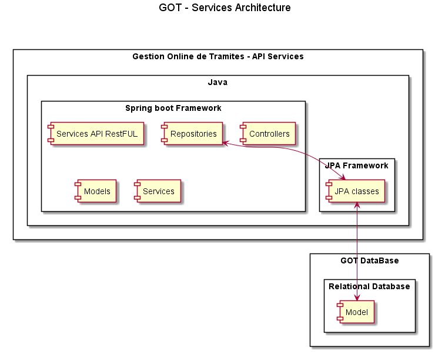

# Architecture
[Back to Home](/README.md) | [Back to General Doc](/docs/readme.md) 

---
## Content
* [Business](#markdown-header-business)
* [DataBase](#markdown-header-database)
* [Diagram Services Architecrure](#markdown-header-SERVICES-architecture)

## Business
- Java components
- Java Web Services
- Java DAO components

### Specifications
- Java 1.8
- Maven
- Spring boot Framework
- Swagger UI Documentation
- JPA Persistence
- H2 Database
- Lonbok library to reduce code
- Springboot Test

## DataBase
- JPA - H2 Database

---
## Diagrams

### Services Architecture

---
[Go to Top](#markdown-header-architecture)  
[Back to Home](/README.md) | [Back to General Doc](/docs/readme.md) 