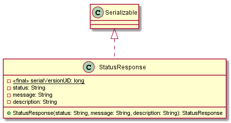

# Classes Documentation - GOT

[Back to Home](/README.md) | [Back to General Doc](/docs/readme.md) | [Go Back](/docs/markdown/classes.md)

## Class Catalog
### com.sa.bbva.got.beans
* [StatusResponse](#markdown-header-statusresponse)

##  StatusResponse
---
### com/sa/bbva/got/beans/
### Diagram

### Inheritance
  * Serializable.java

### Properties
  * private static final long serialVersionUID = 1L;
  * private String status;
  * private String message;
  * private String description;

### Methods
  * public StatusResponse(String status, String message, String description)

---
[Go to Top](#markdown-header-classes-documentation-got)  
[Back to Home](/README.md) | [Back to General Doc](/docs/readme.md) | [Go Back](/docs/markdown/classes.md)
