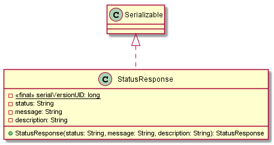

# Classes Documentation - GOT

[Back to Home](/README.md) | [Back to General Doc](/docs/readme.md) | [Back to Delivery](/docs/markdown/delivery.md) | [Go Back](/docs/markdown/classes.md)

## Class Catalog
### com.sa.bbva.got.bootstrap
* [CRUDStatus](#markdown-header-crudstatus)
* [Page](#markdown-header-page)
* [StatusBase](#markdown-header-statusbase)

##  SpringJpaBootstrap
---
### com/sa/bbva/got/bootstrap/
### Diagram

### Inheritance
  * ApplicationListener.java

### Properties
  *  private SectorService sectorService
  *  private ComisionService comisionService
  *  private EstadoTramiteService estadoTramiteService
  *  private CampoDisponibleService campoDisponibleService
  *  private TipoTramiteService tipoTramiteService
  *  private TipoTramiteCampoService tipoTramiteCampoService
  *  private AutorizadoService autorizadoService
  *  private TramiteService tramiteService
  *  private TramiteDetalleService tramiteDetalleService
  *  private TramiteAutorizadoService tramiteAutorizadoService
  *  private Logger log

### Methods
  * public void setSectorService(SectorService sectorService)
  * public void setComisionService(ComisionService comisionService)
  * public void setEstadoTramiteService(EstadoTramiteService estadoTramiteService)
  * public void setCampoDisponibleService(CampoDisponibleService campoDisponibleService)
  * public void setTipoTramiteService(TipoTramiteService tipoTramiteService)
  * public void setTipoTramiteCampoService(TipoTramiteCampoService tipoTramiteCampoService)
  * public void setAutorizadoService(AutorizadoService autorizadoService)
  * public void setTramiteDetalleService(TramiteDetalleService tramiteDetalleService)
  * public void setTramiteService(TramiteService tramiteService)
  * public void setTramiteAutorizadoService(TramiteAutorizadoService tramiteAutorizadoService)
  * public void onApplicationEvent(ContextRefreshedEvent event)
  * private void loadSectores()
  * private void loadComisiones()
  * private void loadEstadosTramite()
  * private void loadCamposDisponible()
  * private void loadTipoTramite()
  * private void loadTipoTramiteCampo()
  * private void loadTramite()
  * private void loadAutorizado()
  * private void loadTramiteDetalle()
  * private void loadTramiteAutorizado()

---
[Go to Top](#markdown-header-classes-documentation-got)  
[Back to Home](/README.md) | [Back to General Doc](/docs/readme.md) | [Back to Delivery](/docs/markdown/delivery.md) | [Go Back](/docs/markdown/classes.md)
