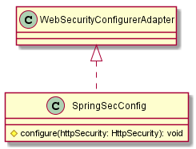
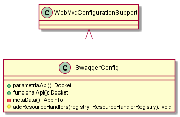
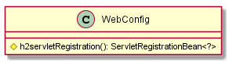

# Classes Documentation - GOT

[Back to Home](/README.md) | [Back to General Doc](/docs/readme.md) | [Back to Delivery](/docs/markdown/delivery.md) | [Go Back](/docs/markdown/classes.md)

## Class Catalog
### com.sa.bbva.got.configuration
* [SpringSecConfig](#markdown-header-springsecconfig)
* [SwaggerConfig](#markdown-header-swaggerconfig)
* [WebConfig](#markdown-header-webconfig)

##  SpringSecConfig
---
### com/sa/bbva/got/configuration/
### Diagram

### Inheritance
  * WebSecurityConfigurerAdapter.java

### Properties

### Methods
  * protected void configure(HttpSecurity httpSecurity)

##  SwaggerConfig
---
### com/sa/bbva/got/configuration/
### Diagram

### Inheritance
  * WebMvcConfigurationSupport.java

### Properties

### Methods
  * public Docket parametriaApi()
  * public Docket funcionalApi()
  * private ApiInfo metaData()
  * protected void addResourceHandlers(ResourceHandlerRegistry registry)

##  WebConfig
---
### com/sa/bbva/got/configuration/
### Diagram

### Inheritance

### Properties

### Methods
  * ServletRegistrationBean<?> h2servletRegistration()

---
[Go to Top](#markdown-header-classes-documentation-got)  
[Back to Home](/README.md) | [Back to General Doc](/docs/readme.md) | [Back to Delivery](/docs/markdown/delivery.md) | [Go Back](/docs/markdown/classes.md)
