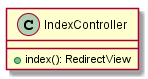
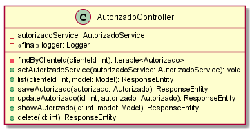

# Classes Documentation - GOT

[Back to Home](/README.md) | [Back to General Doc](/docs/readme.md) | [Back to Delivery](/docs/markdown/delivery.md) | [Go Back](/docs/markdown/classes.md)

### com.sa.bbva.got.controller
* [IndexController] (#markdown-header-indexcontroller)

### com.sa.bbva.got.controller.funcional
* [AutorizadoController](#markdown-header-autorizadocontroller)
* [TramiteController](#markdown-header-tramitecontroller)

### com.sa.bbva.got.controller.parametria
* [CampoDisponibleController](#markdown-header-campodisponiblecontroller)
* [ComisionController](#markdown-header-comisioncontroller)
* [EstadoTramiteController](#markdown-header-estadotramitecontroller)
* [SectorController](#markdown-header-sectorcontroller)
* [TipoTramiteController](#markdown-header-tipotramitecontroller)

##  IndexController
---
### com/sa/bbva/got/controller/
### Diagram

### Inheritance
### Properties
### Methods
* public RedirectView index()

##  AutorizadoController
---
### com/sa/bbva/got/controller/funcional/
### Diagram

### Inheritance
### Properties
* public Logger log
* public AccionService service

### Methods
* public ResponseEntity<Page> listAll(HttpServletRequest req, Integer first, Integer rows, String sortField, String sortOrder, List<Long> gasto, List<Long> centroCostos, List<String> tipoAlertaPeriodo)
* public ResponseEntity<CRUDStatus> create(Alerta alerta, HttpServletRequest req)
* public ResponseEntity<CRUDStatus> update(Alerta alerta, HttpServletRequest req)
* public ResponseEntity<CRUDStatus> delete(long id, HttpServletRequest req)

##  TramiteController
---
### com/sa/bbva/got/controller/funcional/
### Diagram

### Inheritance
### Properties
* private TramiteService tramiteService
* private TramiteDetalleService tramiteDetalleService
* private TramiteAutorizadoService tramiteAutorizadoService
* private final Logger logger

### Methods
* public void setTramiteService(TramiteService tramiteService)
* public void setTramiteDetalleService(TramiteDetalleService tramiteDetalleService)
* public void setTramiteAutorizadoService(TramiteAutorizadoService tramiteAutorizadoService)
* public ResponseEntity<?> list(HttpServletRequest req, Model model,
            @RequestParam(value = "activo", required = false) boolean activo,
            @RequestParam(value = "sector", required = false) Integer sectorId)
* public ResponseEntity<?> saveTramite(@RequestBody Tramite tramite)
* public ResponseEntity<?> updateTramite(@PathVariable Integer id, @RequestBody Tramite tramite)
* public ResponseEntity<?> showTramite(@PathVariable Integer id, Model model)
* public ResponseEntity<?> delete(@PathVariable Integer id)
* public ResponseEntity<?> listAllTramiteDetalle(Model model)
* public ResponseEntity<?> listTramiteDetalle(@PathVariable Integer id, Model model)
* public ResponseEntity<?> saveTramiteDetalle(@RequestBody TramiteDetalle tramiteDetalle)
* public ResponseEntity<?> updateTramiteDetalle(@PathVariable Integer tramiteId,
            @PathVariable Integer tipoTramiteCampoId, @PathVariable Integer campoDisponibleId,
            @RequestBody TramiteDetalle tramiteDetalle)
* public ResponseEntity<?> showTramiteDetalle(@PathVariable Integer tramiteId,
            @PathVariable Integer tipoTramiteCampoId, @PathVariable Integer campoDisponibleId, Model model)
* public ResponseEntity<?> deleteTramiteDetalle(@PathVariable Integer tramiteId,
            @PathVariable Integer tipoTramiteCampoId, @PathVariable Integer campoDisponibleId, Model model)
* public ResponseEntity<?> listTramiteAutorizado(@PathVariable Integer id, Model model)
* public ResponseEntity<?> saveTramiteAutorizado(@RequestBody TramiteAutorizado tramiteAutorizado)
* public ResponseEntity<?> deleteTramiteAutorizado(@PathVariable Integer tramiteId,
            @PathVariable Integer autorizadoId, Model model)

##  CampoDisponibleController
---
### com/sa/bbva/got/controller/parametria/
### Diagram

### Inheritance
### Properties
* private CampoDisponibleService campoDisponibleService
* private final Logger logger

### Methods
* public void setEstadoTramiteService(CampoDisponibleService campoDisponibleService)
* public ResponseEntity<?> list(Model model)
* public ResponseEntity<?> showEstadoTramite(@PathVariable Integer id, Model model)
* public ResponseEntity<?> saveEstadoTramite(@RequestBody CampoDisponible campoDisponible)
* public ResponseEntity<?> updateEstadoTramite(@PathVariable Integer id, @RequestBody CampoDisponible campoDisponible)
* public ResponseEntity<?> delete(@PathVariable Integer id)

##  ComisionController
---
### com/sa/bbva/got/controller/funcional/
### Diagram

### Inheritance
### Properties
* public Logger logger
* private ComisionService comisionService

### Methods
* public void setComisionService(ComisionService comisionService)
* public ResponseEntity<?> list(Model model)
* public ResponseEntity<?> showComision(@PathVariable Integer id, Model model)
* public ResponseEntity<?> saveComision(@RequestBody Comision comision)
* public ResponseEntity<?> updateComision(@PathVariable Integer id, @RequestBody Comision comision)
* public ResponseEntity<?> delete(@PathVariable Integer id)

##  EstadoTramiteController
---
### com/sa/bbva/got/controller/funcional
### Diagram

### Inheritance
### Properties
* public Logger log
* private EstadoTramiteService estadoTramiteService

### Methods
* public void setEstadoTramiteService(EstadoTramiteService estadoTramiteService)
* public ResponseEntity<?> showEstadoTramite(@PathVariable Integer id, Model model)
* public ResponseEntity<?> saveEstadoTramite(@RequestBody EstadoTramite estadoTramite)
* public ResponseEntity<?> updateEstadoTramite(@PathVariable Integer id, @RequestBody EstadoTramite estadoTramite)
* public ResponseEntity<?> delete(@PathVariable Integer id)

##  SectorController
---
### com/sa/bbva/got/controller/funcional/
### Diagram

### Inheritance
### Properties
* public Logger log
* private SectorService sectorService

### Methods
* public void setSectorService(SectorService sectorService)
* public ResponseEntity<?> list(HttpServletRequest req, @RequestParam(value = "activo", required = false) boolean activo)
* public ResponseEntity<?> showSector(@PathVariable Integer id, Model model)
* public ResponseEntity<?> saveSector(@RequestBody Sector sector)
* public ResponseEntity<?> updateSector(@PathVariable Integer id, @RequestBody Sector sector)
* public ResponseEntity<?> delete(@PathVariable Integer id)

##  TipoTramiteController 
---
### com/sa/bbva/got/controller/
### Diagram

### Inheritance
### Properties
* private TipoTramiteService tipoTramiteService
* private ComisionService comisionService
* private TipoTramiteCampoService tipoTramiteCampoService
* private CampoDisponibleService campoDisponibleService
* private final Logger logger

### Methods
* public void setTipoTramiteService(TipoTramiteService tipoTramiteService)
* public void setComisionService(ComisionService comisionService)
* public void setTipoTramiteCampoService(TipoTramiteCampoService tipoTramiteCampoService)
* public void setCampoDisponibleService(CampoDisponibleService campoDisponibleService)
* public ResponseEntity<?> list(HttpServletRequest req, @RequestParam(value = "activo", required = false) boolean activo)
* public ResponseEntity<?> saveTipoTramite(@RequestBody TipoTramite tipoTramite)
* public ResponseEntity<?> showTipoTramite(@PathVariable Integer id, Model model)
* public ResponseEntity<?> updateTipoTramite(@PathVariable Integer id, @RequestBody TipoTramite tipoTramite)
* public ResponseEntity<?> delete(@PathVariable Integer id)
* public ResponseEntity<?> saveComisionTipoTramite(@RequestBody TipoTramite tipoTramite)
* public ResponseEntity<?> showComisionTipoTramite(@PathVariable Integer id, Model model)
* public ResponseEntity<?> deleteComision(@PathVariable Integer id)
* public ResponseEntity<?> listAll(HttpServletRequest req, @RequestParam(value = "activo", required = false) boolean activo)
* public ResponseEntity<?> list(@PathVariable Integer id)
* public ResponseEntity<?> saveTipoTramiteCampo(@RequestBody TipoTramiteCampo tipoTramiteCampo)
* public ResponseEntity<?> delete(@PathVariable Integer tipoTramiteId, @PathVariable Integer campoDisponibleId, @RequestBody TipoTramiteCampo tipoTramiteCampo)
* public ResponseEntity<?> updateTipoTramite(@PathVariable Integer tipoTramiteId, @PathVariable Integer campoDisponibleId, @RequestBody TipoTramiteCampo tipoTramiteCampo)

---
[Go to Top](#markdown-header-classes-documentation-got)  
[Back to Home](/README.md) | [Back to General Doc](/docs/readme.md) | [Back to Delivery](/docs/markdown/delivery.md) | [Go Back](/docs/markdown/classes.md)