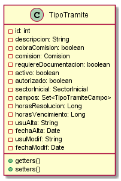

# Classes Documentation - GOT

[Back to Home](/README.md) | [Back to General Doc](/docs/readme.md) | [Go Back](/docs/markdown/classes.md)

### com.sa.bbva.got.model
* [Autorizado](#markdown-header-autorizado)
* [CampoDisponible](#markdown-header-campodisponible)
* [Comision](#markdown-header-comision)
* [EstadoTramite](#markdown-header-estadotramite)
* [Sector](#markdown-header-sector)
* [TipoTramite](#markdown-header-tipotramite)
* [TipoTramiteCampo](#markdown-header-tipotramitecampo)
* [TipoTramiteCampoKey](#markdown-header-tipotramitecampokey)
* [Tramite](#markdown-header-tramite)
* [TramiteAutorizado](#markdown-header-tramiteautorizado)
* [TramiteAutorizadoKey](#markdown-header-tramiteautorizadokey)
* [TramiteDetalle](#markdown-header-tramitedetalle)
* [TramiteDetalleKey](#markdown-header-tramitedetallekey)

##  Autorizado
---
### com/sa/bbva/got/model/
### Diagram

### Inheritance
### Properties
* private Integer id
* private Integer clienteId
* private String tipoDocumento
* private String nroDocumento
* private String nombre
* private String apellido
* private String usuAlta
* private Date fechaAlta
* private String usuModif
* private Date fechaModif

### Methods
* public getters()
* public void setters()

##  CampoDisponible
---
### com/sa/bbva/got/model/
### Diagram

### Inheritance

### Properties
* private Integer id
* private String nombre
* private String descripcion
* private String tipoDato
* private boolean activo
* private String usuAlta
* private Date fechaAlta
* private String usuModif
* private Date fechaModif

### Methods
* public getters()
* public void setters()

##  Comision
---
### com/sa/bbva/got/model/
### Diagram

### Inheritance
### Properties
* private Integer id
* private String param1
* private String param2
* private String param3
* private String param4
* private String param5
* private String usuAlta
* private Date fechaAlta
* private String usuModif
* private Date fechaModif

### Methods
* public getters()
* public void setters()

##  EstadoTramite
---
### com/sa/bbva/got/model/
### Diagram

### Inheritance

### Properties
* private Integer id
* private String descripcion
* private boolean cobraComision
* private Comision comision
* private boolean requiereDocumentacion
* private boolean activo
* private boolean autorizado
* private Sector sectorInicial
* private Set<TipoTramiteCampo> campos
* private Long horasResolucion
* private Long horasVencimiento
* private String usuAlta
* private Date fechaAlta
* private String usuModif
* private Date fechaModif

### Methods
* public getters()
* public void setters()

##  Sector
---
### com/sa/bbva/got/model/
### Diagram

### Inheritance

### Properties
* private Integer id
* private String canal
* private String sector
* private String descripcion
* private boolean activo
* private String usuAlta
* private Date fechaAlta
* private String usuModif
* private Date fechaModif

### Methods
* public getters()
* public void setters()

##  TipoTramite
---
### com/sa/bbva/got/model/
### Diagram

### Inheritance
### Properties
* private Integer id
* private String descripcion
* private boolean cobraComision
* private Comision comision
* private boolean requiereDocumentacion
* private boolean activo
* private boolean autorizado
* private Sector sectorInicial
* private Set<TipoTramiteCampo> campos
* private Long horasResolucion
* private Long horasVencimiento
* private String usuAlta
* private Date fechaAlta
* private String usuModif
* private Date fechaModif

### Methods
* public getters()
* public void setters()

##  TipoTramiteCampo
---
### com/sa/bbva/got/model/
### Diagram

### Inheritance
### Properties
* private TipoTramiteCampoKey id
* private CampoDisponible campoDisponible
* private boolean obligatorio
* private boolean activo
* private String nombre
* private String leyenda
* private String usuAlta
* private Date fechaAlta
* private String usuModif
* private Date fechaModif

### Methods
* public getters()
* public void setters()

##  TipoTramiteCampoKey
---
### com/sa/bbva/got/model/
### Diagram

### Inheritance
### Properties
  * private static final long serialVersionUID
  * Integer tipoTramiteId
  * Integer campoDisponibleId

### Methods
* public getters()
* public void setters()
* public TipoTramiteCampoKey()
* public TipoTramiteCampoKey(Integer tipoTramiteId, Integer campoDisponibleId)

##  Tramite
---
### com/sa/bbva/got/model/
### Diagram

### Inheritance
### Properties
* private Integer id
* private TipoTramite tipoTramite
* private Integer clienteId
* private Set<TramiteAutorizado> autorizado
* private Sector sectorInicio
* private Sector sectorActual
* private Set<TramiteDetalle> detalle
* private String cuentaCobro
* private EstadoTramite estado
* private Date fechaFinalizacion
* private Date fechaInicio
* private Date fechaVencimiento
* private String usuAlta
* private Date fechaAlta
* private String usuModif
* private Date fechaModif

### Methods
* public getters()
* public void setters()

##  TramiteAutorizado
---
### com/sa/bbva/got/model/
### Diagram

### Inheritance
* BaseEntity

### Properties
* private TramiteAutorizadoKey id
* private Autorizado autorizado
* private String usuAlta
* private Date fechaAlta

### Methods
* public getters()
* public void setters()

##  TramiteAutorizadoKey
---
### com/sa/bbva/got/model/
### Diagram

### Inheritance
* Serializable

### Properties
  * Integer tramiteId
  * Integer autorizadoId

### Methods
* public getters()
* public void setters()
* public TramiteAutorizadoKey()
* public TramiteAutorizadoKey(Integer tramiteId, Integer autorizadoId)

##  TramiteDetalle
---
### com/sa/bbva/got/model/
### Diagram

### Inheritance

### Properties
* private TramiteDetalleKey id
* private String valor
* private String usuAlta
* private Date fechaAlta
* private String usuModif
* private Date fechaModif

### Methods
* public getters()
* public void setters()

##  TramiteDetalleKey
---
### com/sa/bbva/got/model/
### Diagram

### Inheritance
* Serializable

### Properties
* private static final long serialVersionUID
* private Integer tramiteId
* private TipoTramiteCampoKey tipoTramiteCampoId

### Methods
* public getters()
* public void setters()
* public TramiteDetalleKey()
* public TramiteDetalleKey(Integer tramiteId, Integer tipoTramiteId, Integer campoDisponibleId)

---
[Go to Top](#markdown-header-classes-documentation-got)  
[Back to Home](/README.md) | [Back to General Doc](/docs/readme.md) | [Go Back](/docs/markdown/classes.md)