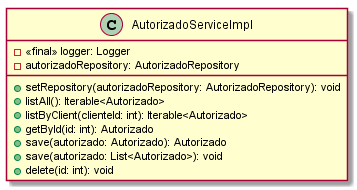
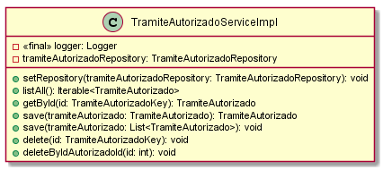
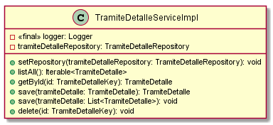
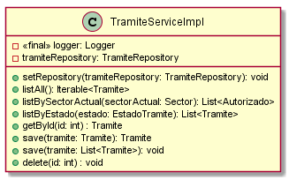
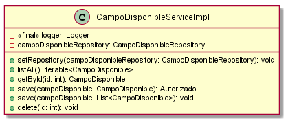
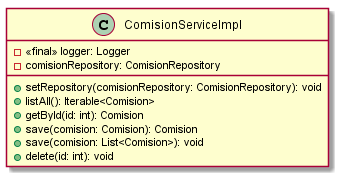
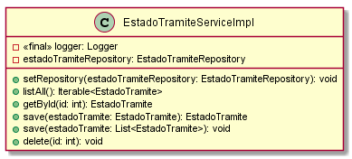
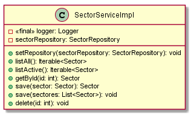
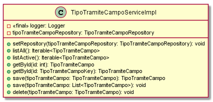

# Classes Documentation - GOT

[Back to Home](/README.md) | [Back to General Doc](/docs/readme.md) | [Back to Delivery](/docs/markdown/delivery.md) | [Go Back](/docs/markdown/classes.md)

### com.sa.bbva.got.service.funcional
* [AutorizadoServiceImpl](#markdown-header-autorizadoserviceimpl)
* [TramiteAutorizadoServiceImpl](#markdown-header-tramiteautorizadoserviceimpl)
* [TramiteDetalleServiceImpl](#markdown-header-tramitedetalleserviceimpl)
* [TramiteServiceImpl](#markdown-header-tramiteserviceimpl)

### com.sa.bbva.got.service.parametria
* [CampoDisponibleServiceImpl](#markdown-header-campodisponibleserviceimpl)
* [ComisionServiceImpl](#markdown-header-comisionserviceimpl)
* [EstadoTramiteServiceImpl](#markdown-header-estadotramiteserviceimpl)
* [SectorServiceImpl](#markdown-header-sectorserviceimpl)
* [TipoTramiteCampoServiceImpl](#markdown-header-tipotramitecamposerviceimpl)
* [TipoTramiteServiceImpl](#markdown-header-tipotramiteserviceimpl)

##  AutorizadoServiceImpl
---
### com/sa/bbva/got/service/funcional/
### Diagram

### Inheritance
AutorizadoService

### Properties
* private final Logger logger
* private AutorizadoRepository autorizadoRepository

### Methods
* public void setRepository(AutorizadoRepository autorizadoRepository)
* public Iterable<Autorizado> listAll()
* public Iterable<Autorizado> listByClient(Integer clienteId)
* public Autorizado getById(Integer id)
* public Autorizado save(Autorizado autorizado)
* public void save(List<Autorizado> autorizado)
* public void delete(Integer id)

##  TramiteAutorizadoServiceImpl
---
### com/sa/bbva/got/service/funcional/
### Diagram

### Inheritance
TramiteAutorizadoService

### Properties
* private final Logger logger
* private TramiteAutorizadoRepository tramiteAutorizadoRepository

### Methods
* public void setRepository(TramiteAutorizadoRepository tramiteAutorizadoRepository)
* public Iterable<TramiteAutorizado> listAll()
* public TramiteAutorizado getById(TramiteAutorizadoKey id)
* public TramiteAutorizado save(TramiteAutorizado tramiteAutorizado)
* public void save(List<TramiteAutorizado> tramiteAutorizado)
* public void delete(TramiteAutorizadoKey id)
* public void deleteByIdAutorizadoId(Integer id)

##  TramiteDetalleServiceImpl
---
### com/sa/bbva/got/service/funcional/
### Diagram

### Inheritance
TramiteDetalleService

### Properties
* private final Logger logger
* private TramiteDetalleRepository tramiteDetalleRepository

### Methods
* public void setRepository(TramiteDetalleRepository tramiteDetalleRepository)
* public Iterable<TramiteDetalle> listAll()
* public TramiteDetalle getById(TramiteDetalleKey id)
* public TramiteDetalle save(TramiteDetalle tramiteDetalle)
* public void save(List<TramiteDetalle> tramiteDetalle)
* public void delete(TramiteDetalleKey id)

##  TramiteServiceImpl
---
### com/sa/bbva/got/service/funcional/
### Diagram

### Inheritance
TramiteService

### Properties
* private final Logger logger
* private TramiteRepository tramiteRepository

### Methods
* public void setRepository(TramiteRepository tramiteRepository)
* public Iterable<Tramite> listAll()
* public List<Tramite> listBySectorActual(Sector sectorActual)
* public List<Tramite> listByEstado(EstadoTramite estado)
* public Tramite getById(Integer id)
* public Tramite save(Tramite tramite)
* public void save(List<Tramite> tramite)
* public void delete(Integer id)

##  CampoDisponibleServiceImpl
---
### com/sa/bbva/got/service/parametria/
### Diagram

### Inheritance
CampoDisponibleService
### Properties
* private final Logger logger
* private CampoDisponibleRepository campoDisponibleRepository

### Methods
* public void setRepository(CampoDisponibleRepository campoDisponibleRepository)
* public Iterable<CampoDisponible> listAll()
* public CampoDisponible getById(Integer id)
* public CampoDisponible save(CampoDisponible campoDisponible)
* public void save(List<CampoDisponible> campoDisponible)
* public void delete(Integer id)

##  ComisionServiceImpl
---
### com/sa/bbva/got/service/parametria/
### Diagram

### Inheritance
ComisionService

### Properties
* private final Logger logger
* private ComisionRepository comisionRepository

### Methods
* public void setRepository(ComisionRepository comisionRepository)
* public Iterable<Comision> listAll()
* public Comision getById(Integer id)
* public Comision save(Comision comision)
* public void save(List<Comision> comision)
* public void delete(Integer id)

##  EstadoTramiteServiceImpl
---
### com/sa/bbva/got/service/parametria/
### Diagram

### Inheritance
EstadoTramiteService
### Properties
* private final Logger logger
* private EstadoTramiteRepository estadoTramiteRepository

### Methods
* public void setRepository(EstadoTramiteRepository estadoTramiteRepository)
* public Iterable<EstadoTramite> listAll()
* public EstadoTramite getById(Integer id)
* public EstadoTramite save(EstadoTramite estadoTramite)
* public void save(List<EstadoTramite> estadoTramite)
* public void delete(Integer id)

##  SectorServiceImpl
---
### com/sa/bbva/got/service/parametria/
### Diagram

### Inheritance
SectorService
### Properties
* private final Logger logger
* private SectorRepository sectorRepository

### Methods
* public void setSectorRepository(SectorRepository sectorRepository)
* public Iterable<Sector> listAll()
* public Iterable<Sector> listActive()
* public Sector getById(Integer id)
* public Sector save(Sector sector)
* public void save(List<Sector> sectores)
* public void delete(Integer id)

##  TipoTramiteCampoServiceImpl
---
### com/sa/bbva/got/service/parametriA/
### Diagram

### Inheritance
TipoTramiteCampoService
### Properties
* private final Logger logger
* private TipoTramiteCampoRepository tipoTramiteCampoRepository

### Methods
* public void setRepository(TipoTramiteCampoRepository tipoTramiteCampoRepository)
* public Iterable<TipoTramiteCampo> listAll()
* public Iterable<TipoTramiteCampo> listActive()
* public TipoTramiteCampo getById(int id)
* public TipoTramiteCampo getById(TipoTramiteCampoKey id)
* public TipoTramiteCampo save(TipoTramiteCampo tipoTramiteCampo)
* public void save(List<TipoTramiteCampo> tipoTramiteCampo)
* public void delete(TipoTramiteCampo tipoTramiteCampo)

##  TipoTramiteServiceImpl
---
### com/sa/bbva/got/service/parametria/
### Diagram

### Inheritance
TipoTramiteService

### Properties
* private final Logger logger
* private TipoTramiteRepository tipoTramiteRepository

### Methods
* public void setRepository(TipoTramiteRepository tipoTramiteRepository)
* public Iterable<TipoTramite> listAll()
* public Iterable<TipoTramite> listActive()
* public TipoTramite getById(Integer id)
* public TipoTramite save(TipoTramite tipoTramite)
* public void save(List<TipoTramite> tipoTramite)
* public void delete(Integer id)

---
[Go to Top](#markdown-header-classes-documentation-got)  
[Back to Home](/README.md) | [Back to General Doc](/docs/readme.md) | [Back to Delivery](/docs/markdown/delivery.md) | [Go Back](/docs/markdown/classes.md)