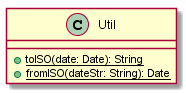

# Classes Documentation - GOT

[Back to Home](/README.md) | [Back to General Doc](/docs/readme.md) | [Back to Delivery](/docs/markdown/delivery.md) | [Go Back](/docs/markdown/classes.md)

## Class Catalog
### com.sa.bbva.got.util
* [Util](#markdown-header-util)

##  Util
---
### com/sa/bbva/got/util/
### Diagram

### Inheritance

### Properties

### Methods
* public static String toISO(Date date)
* public static Date fromISO(String dateStr)

---
[Go to Top](#markdown-header-classes-documentation-got)  
[Back to Home](/README.md) | [Back to General Doc](/docs/readme.md) | [Back to Delivery](/docs/markdown/delivery.md) | [Go Back](/docs/markdown/classes.md)
