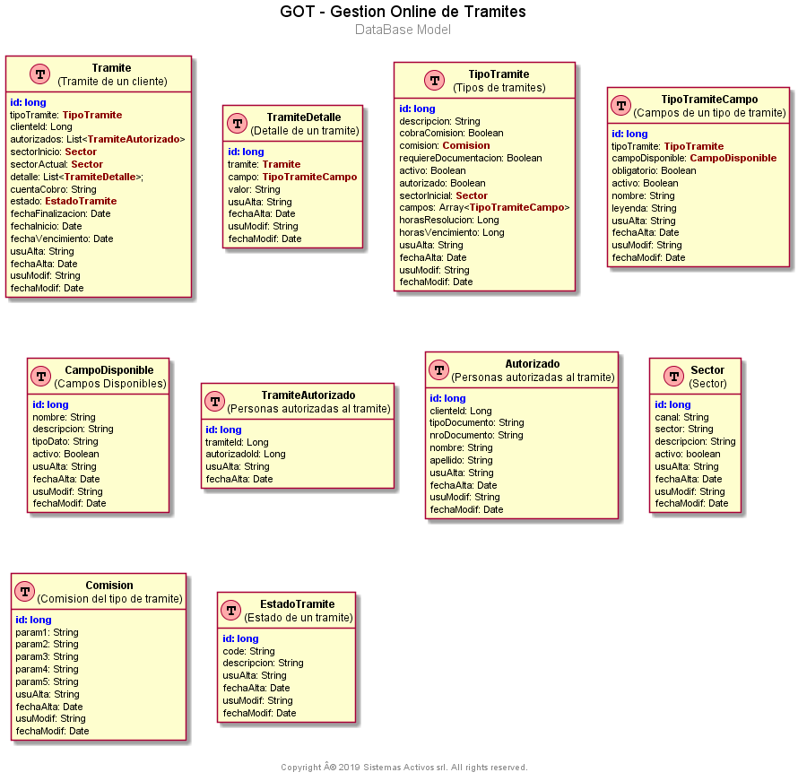

# Database Model
[Back to Home](/README.md) | [Back to General Doc](/docs/readme.md)

---

## Content
* [Database Scripts](#markdown-header-oracle-script)
* [DER](#markdown-header-der)
* [Tables Catalog](#markdown-header-tables-catalog)

## Database Scripts
[create_tables.sql](/db/create_tables.sql)

## Model

## DER

## Tables Catalog
* [SECTOR](#markdown-header-sector)
* [COMISION](#markdown-header-comision)
* [ESTADO_TRAMITE](#markdown-header-estado_tramite)
* [TIPO_TRAMITE](#markdown-header-tipo_tramite)
* [TIPO_TRAMITE_CAMPO](#markdown-header-tipo_tramite_campo)
* [CAMPO_DISPONIBLE](#markdown-header-campo_disponible)
* [TRAMITE](#markdown-header-tramite)
* [TRAMITE_DETALLE](#markdown-header-tramite_detalle)
* [AUTORIZADO](#markdown-header-autorizado)
* [TRAMITE_AUTORIZADO](#markdown-header-tramite-autorizado)

---
###   SECTOR

|  Attr             |    Type            |  Default           |   Description                 |
|-------------------|:-------------------|:-------------------|:------------------------------|
|  ID               | NUMBER(19,0)       |                    |                               |
|  SECTOR           | VARCHAR2(255 CHAR) |                    |                               |
|  CANAL            | VARCHAR2(255 CHAR) |                    |                               |
|  DESCRIPCION      | VARCHAR2(255 CHAR) |                    |                               |
|  ACTIVO   		| NUMBER(1,0)		 |                    |                               |
|  USU_ALTA         | VARCHAR2(8 CHAR)   |                    |                               |
|  FECHA_ALTA       | TIMESTAMP (6) 	 | DEFAULT sysdate    |                               |
|  USU_MODIF        | VARCHAR2(8 CHAR)   |                    |                               |
|  FECHA_MODIF      | TIMESTAMP (6)      |                    |                               |     	   
      
---
###   COMISION

|  Attr             |    Type            |  Default           |   Description                 |
|-------------------|:-------------------|:-------------------|:------------------------------|
|  ID               | NUMBER(19,0)       |                    |                               |
|  PARAM1           | VARCHAR2(255 CHAR) |                    |                               |
|  PARAM2           | VARCHAR2(255 CHAR) |                    |                               |
|  PARAM3           | VARCHAR2(255 CHAR) |                    |                               |
|  PARAM4   		| VARCHAR2(255 CHAR) |                    |                               |
|  PARAM5   		| VARCHAR2(255 CHAR) |                    |                               |
|  USU_ALTA         | VARCHAR2(8 CHAR)   |                    |                               |
|  FECHA_ALTA       | TIMESTAMP (6) 	 | DEFAULT sysdate    |                               |
|  USU_MODIF        | VARCHAR2(8 CHAR)   |                    |                               |
|  FECHA_MODIF      | TIMESTAMP (6)      |                    |                               |     

---
###   ESTADO_TRAMITE

|  Attr             |    Type            |  Default           |   Description                 |
|-------------------|:-------------------|:-------------------|:------------------------------|
|  ID               | NUMBER(19,0)       |                    |                               |
|  CODE             | VARCHAR2(50 CHAR)  |                    |                               |
|  DESCRIPCION      | VARCHAR2(255 CHAR) |                    |                               |
|  USU_ALTA         | VARCHAR2(8 CHAR)   |                    |                               |
|  FECHA_ALTA       | TIMESTAMP (6) 	 | DEFAULT sysdate    |                               |
|  USU_MODIF        | VARCHAR2(8 CHAR)   |                    |                               |
|  FECHA_MODIF      | TIMESTAMP (6)      |                    |                               |     	   
---
###   TIPO_TRAMITE

|  Attr             |    Type            |  Default           |   Description                 |
|-------------------|:-------------------|:-------------------|:------------------------------|
|  ID               | NUMBER(19,0)       |                    |                               |
|  CODE             | VARCHAR2(50 CHAR)  |                    |                               |
|  DESCRIPCION      | VARCHAR2(255 CHAR) |                    |                               |
|  COBRA_COMISION 	| NUMBER(1,0)		 |                    |                               |
|  COMISION_ID  	| NUMBER(19,0)		 |                    |                               |
|  REQUIERE_DOC 	| NUMBER(1,0)		 |                    |                               |
|  ACTIVO           | NUMBER(1,0)		 |                    |                               |
|  AUTORIZADO       | NUMBER(1,0)		 |                    |                               |
|  SECTOR_INICIAL_ID| NUMBER(19,0)		 |                    |                               |
|  HORAS_RESOLUCION | NUMBER(19,0)		 |                    |                               |
|  HORAS_VENCIM     | NUMBER(19,0)		 |                    |                               |
|  USU_ALTA         | VARCHAR2(8 CHAR)   |                    |                               |
|  FECHA_ALTA       | TIMESTAMP (6) 	 | DEFAULT sysdate    |                               |
|  USU_MODIF        | VARCHAR2(8 CHAR)   |                    |                               |
|  FECHA_MODIF      | TIMESTAMP (6)      |                    |                               |     	 

---
###   TIPO_TRAMITE_CAMPO

|  Attr             |    Type            |  Default           |   Description                 |
|-------------------|:-------------------|:-------------------|:------------------------------|
|  ID               | NUMBER(19,0)       |                    |                               |
|  CODE             | VARCHAR2(50 CHAR)  |                    |                               |
|  DESCRIPCION      | VARCHAR2(255 CHAR) |                    |                               |
|  TIPO_TRAMITE_ID 	| NUMBER(19,0)		 |                    |                               |
|  CAMPO_DISP_ID 	| NUMBER(19,0)		 |                    |                               |
|  OBLIGATORIO   	| NUMBER(1,0)		 |                    |                               |
|  ACTIVO           | NUMBER(1,0)		 |                    |                               |
|  NOMBRE           | VARCHAR2(255 CHAR) |                    |                               |
|  LEYENDA          | VARCHAR2(255 CHAR) |                    |                               |
|  USU_ALTA         | VARCHAR2(8 CHAR)   |                    |                               |
|  FECHA_ALTA       | TIMESTAMP (6) 	 | DEFAULT sysdate    |                               |
|  USU_MODIF        | VARCHAR2(8 CHAR)   |                    |                               |
|  FECHA_MODIF      | TIMESTAMP (6)      |                    |                               |     	 
---
###   CAMPO_DISPONIBLE

|  Attr             |    Type            |  Default           |   Description                 |
|-------------------|:-------------------|:-------------------|:------------------------------|
|  ID               | NUMBER(19,0)       |                    |                               |
|  NOMBRE           | VARCHAR2(255 CHAR) |                    |                               |
|  DESCRIPCION      | VARCHAR2(255 CHAR) |                    |                               |
|  TIPO_DATO     	| VARCHAR2(255 CHAR) |                    |                               |
|  ACTIVO           | NUMBER(1,0)		 |                    |                               |
|  USU_ALTA         | VARCHAR2(8 CHAR)   |                    |                               |
|  FECHA_ALTA       | TIMESTAMP (6) 	 | DEFAULT sysdate    |                               |
|  USU_MODIF        | VARCHAR2(8 CHAR)   |                    |                               |
|  FECHA_MODIF      | TIMESTAMP (6)      |                    |                               |     	 
---
###   TRAMITE

|  Attr             |    Type            |  Default           |   Description                 |
|-------------------|:-------------------|:-------------------|:------------------------------|
|  ID               | NUMBER(19,0)       |                    |                               |
|  TIPO_TRAMITE_ID  | NUMBER(19,0)       |                    |                               |
|  CLIENTE_ID       | NUMBER(19,0)       |                    |                               |
|  SECTOR_INICIO_ID | NUMBER(19,0)       |                    |                               |
|  SECTOR_ACTUAL_ID | NUMBER(19,0)       |                    |                               |
|  CUENTA_COBRO     | VARCHAR2(255 CHAR) |                    |                               |
|  ESTADO_ID        |                    |                    |                               |
|  FECHA_FINALIZAC  | TIMESTAMP (6) 	 | DEFAULT sysdate    |                               |
|  FECHA_INICIO     | TIMESTAMP (6) 	 | DEFAULT sysdate    |                               |
|  USU_ALTA         | VARCHAR2(8 CHAR)   |                    |                               |
|  FECHA_ALTA       | TIMESTAMP (6) 	 | DEFAULT sysdate    |                               |
|  USU_MODIF        | VARCHAR2(8 CHAR)   |                    |                               |
|  FECHA_MODIF      | TIMESTAMP (6)      |                    |                               |     	
---
###   TRAMITE_DETALLE

|  Attr             |    Type            |  Default           |   Description                 |
|-------------------|:-------------------|:-------------------|:------------------------------|
|  ID               | NUMBER(19,0)       |                    |                               |
|  TRAMITE_ID       | NUMBER(19,0)       |                    |                               |
|  CAMPO_ID         | NUMBER(19,0)       |                    |                               |
|  VALOR            | VARCHAR2(255 CHAR) |                    |                               |
|  USU_ALTA         | VARCHAR2(8 CHAR)   |                    |                               |
|  FECHA_ALTA       | TIMESTAMP (6) 	 | DEFAULT sysdate    |                               |
|  USU_MODIF        | VARCHAR2(8 CHAR)   |                    |                               |
|  FECHA_MODIF      | TIMESTAMP (6)      |                    |                               |     	
---
###   AUTORIZADO

|  Attr             |    Type            |  Default           |   Description                 |
|-------------------|:-------------------|:-------------------|:------------------------------|
|  ID               | NUMBER(19,0)       |                    |                               |
|  CLIENTE_ID       | NUMBER(19,0)       |                    |                               |
|  TIPO_DOCUMENTO   | VARCHAR2(255 CHAR) |                    |                               |
|  NRO_DOCUMENTO    | VARCHAR2(255 CHAR) |                    |                               |
|  NOMBRE           | VARCHAR2(255 CHAR) |                    |                               |
|  APELLIDO         | VARCHAR2(255 CHAR) |                    |                               |
|  USU_ALTA         | VARCHAR2(8 CHAR)   |                    |                               |
|  FECHA_ALTA       | TIMESTAMP (6) 	 | DEFAULT sysdate    |                               |
|  USU_MODIF        | VARCHAR2(8 CHAR)   |                    |                               |
|  FECHA_MODIF      | TIMESTAMP (6)      |                    |                               |     	
---
###   TRAMITE_AUTORIZADO

|  Attr             |    Type            |  Default           |   Description                 |
|-------------------|:-------------------|:-------------------|:------------------------------|
|  ID               | NUMBER(19,0)       |                    |                               |
|  TRAMITE_ID       | NUMBER(19,0)       |                    |                               |
|  AUTORIZADO_ID    | NUMBER(19,0)       |                    |                               |
|  VALOR            | VARCHAR2(255 CHAR) |                    |                               |
|  USU_ALTA         | VARCHAR2(8 CHAR)   |                    |                               |
|  FECHA_ALTA       | TIMESTAMP (6) 	 | DEFAULT sysdate    |                               |

---
[Go to Top](#markdown-header-database-model-got)  
[Back to Home](/README.md) | [Back to General Doc](/docs/readme.md) 