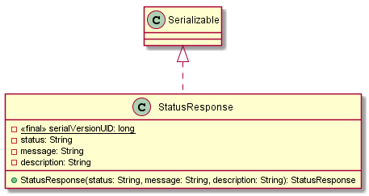
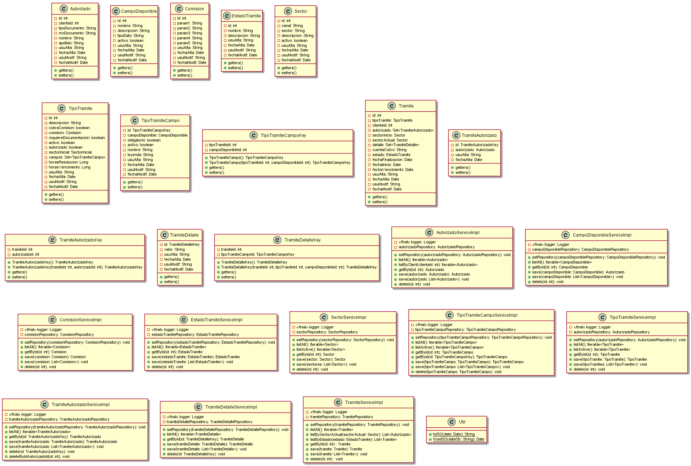
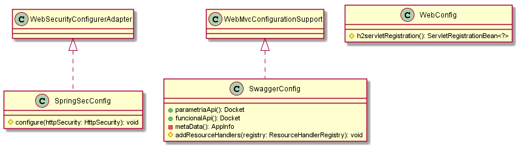
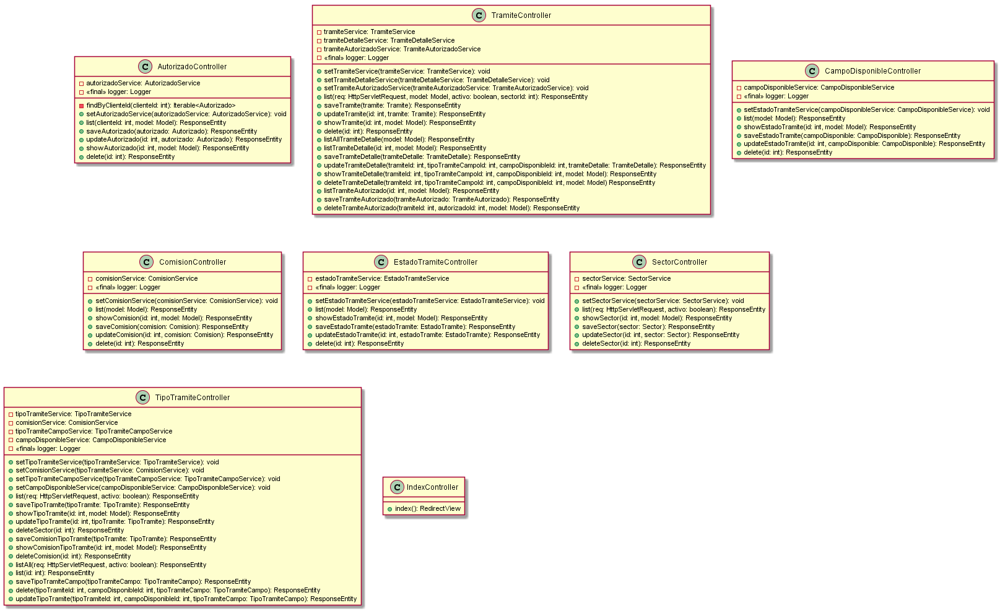
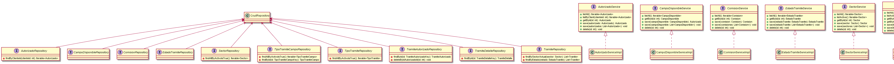

# Diagram Classes Documentation - GOT

[Back to Home](/README.md) | [Back to General Doc](/docs/readme.md) | [Back to Delivery](/docs/markdown/delivery.md) | [Go Back](/docs/markdown/technical.md)

---

## Content
* [Package Beans Diagram](#markdown-header-package-beans-diagram)
* [Package Classes Diagram](#markdown-header-package-classes-diagram)
* [Package Configuration Diagram](#markdown-header-package-configuration-diagram)
* [Package Controller Diagram](#markdown-header-package-controller-diagram)
* [Package Dao Diagram](#markdown-header-package-dao-diagram)
* [Package Interfaces Diagram](#markdown-header-package-interfaces-diagram)

## Package Beans Diagram

## Package Classes Diagram

## Package Configuration Diagram

## Package Controller Diagram

## Package Interfaces Diagram

---
[Go to Top](#markdown-header-diagram-classes-documentation-got)  
[Back to Home](/README.md) | [Back to General Doc](/docs/readme.md) | [Back to Delivery](/docs/markdown/delivery.md)