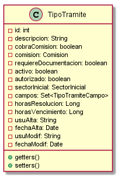

# Classes Documentation - GOT

[Back to Home](/README.md) | [Back to General Doc](/docs/readme.md) | [Back to Delivery](/docs/markdown/delivery.md) | [Go Back](/docs/markdown/classes.md)

### com.sa.bbva.got.repository
* [AutorizadoRepository](#markdown-header-autorizadorepository)
* [CampoDisponibleRepository](#markdown-header-campodisponiblerepository)
* [ComisionRepository](#markdown-header-comisionrepository)
* [EstadoTramiteRepository](#markdown-header-estadotramiterepository)
* [SectorRepository](#markdown-header-sector)
* [TipoTramiteCampoRepository](#markdown-header-tipotramitecamporepository)
* [TipoTramiteRepository](#markdown-header-tipotramiterepository)
* [TramiteAutorizadoRepository](#markdown-header-tramiteautorizadorepository)
* [TramiteRepository](#markdown-header-tramiterepository)

##  AutorizadoRepository
---
### com/sa/bbva/got/repository/
### Diagram

### Inheritance
CrudRepository

### Properties

### Methods
* Iterable<Autorizado> findByClienteId(Integer clienteId)

##  CampoDisponibleRepository
---
### com/sa/bbva/got/repository/
### Diagram

### Inheritance
CrudRepository

### Properties

### Methods

##  ComisionRepository
---
### com/sa/bbva/got/repository/
### Diagram

### Inheritance
CrudRepository

### Properties

### Methods

##  EstadoTramiteRepository
---
### com/sa/bbva/got/repository/
### Diagram

### Inheritance
CrudRepository

### Properties

### Methods

##  SectorRepository
---
### com/sa/bbva/got/repository/
### Diagram

### Inheritance
CrudRepository

### Properties

### Methods
* Iterable<Sector> findAllByActivoIsTrue()

##  TipoTramiteRepository
---
### com/sa/bbva/got/model/
### Diagram

### Inheritance
CrudRepository

### Properties

### Methods
* Iterable<TipoTramite> findAllByActivoIsTrue()

##  TipoTramiteCampoRepository
---
### com/sa/bbva/got/repository/
### Diagram

### Inheritance
CrudRepository

### Properties

### Methods
* Iterable<TipoTramiteCampo> findAllByActivoIsTrue()
* TipoTramiteCampo findById(TipoTramiteCampoKey id)

##  TramiteRepository
---
### com/sa/bbva/got/repository/
### Diagram

### Inheritance
CrudRepository

### Properties

### Methods
* List<Tramite> findBySectorActual(Sector sectorActual)
* List<Tramite> findByEstado(EstadoTramite estado)

##  TramiteAutorizadoRepository
---
### com/sa/bbva/got/repository/
### Diagram

### Inheritance
* CrudRepository

### Properties

### Methods
* TramiteAutorizado findById(TramiteAutorizadoKey id)
* void deleteByIdAutorizadoId(Integer id)

##  TramiteDetalleRepository
---
### com/sa/bbva/got/repository/
### Diagram

### Inheritance
CrudRepository

### Properties

### Methods
* TramiteDetalle findById(TramiteDetalleKey id)

---
[Go to Top](#markdown-header-classes-documentation-got)  
[Back to Home](/README.md) | [Back to General Doc](/docs/readme.md) | [Back to Delivery](/docs/markdown/delivery.md) | [Go Back](/docs/markdown/classes.md)